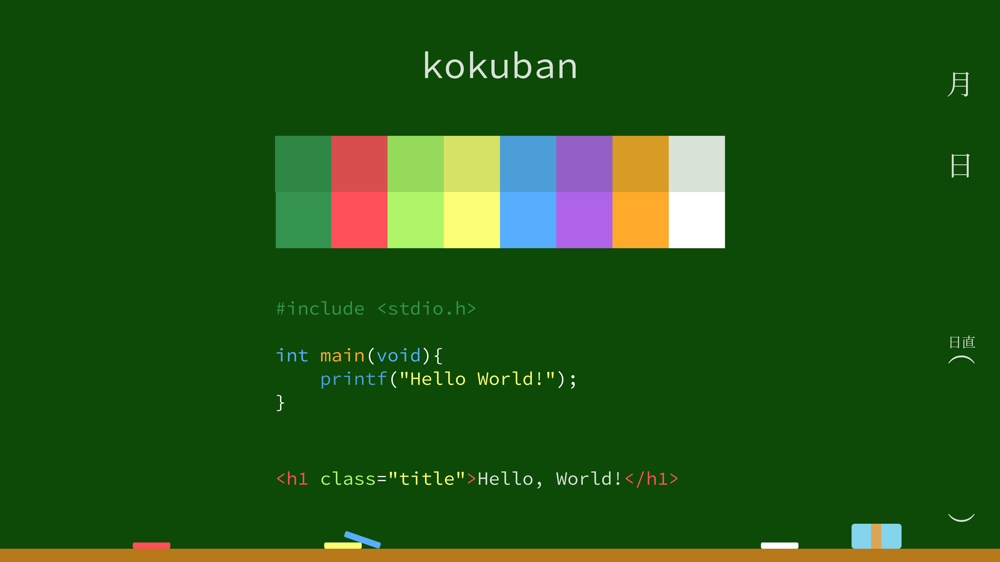

# kokuban

A color-scheme like blackboard. (kokuban means blackboard in Japanese.)

# Colors

## Base

### Background

`#0D4A08`

### Plain Text

`#D8E2D7`

## Highlights

| Color  | Normal    | Bold      |
| ------ | --------- | --------- |
| Color1 | `#2E8744` | `#34934F` |
| Color2 | `#D84E4C` | `#FF4F59` |
| Color3 | `#95DA5A` | `#AFF56A` |
| Color4 | `#D6E264` | `#FCFF75` |
| Color5 | `#4B9ED7` | `#57AEFF` |
| Color6 | `#945FC5` | `#AE63E9` |
| Color7 | `#D89B25` | `#FFAA2B` |
| Color8 | `#D8E2D7` | `#FFFFFF` |

# Editors / Terminals

Not yet but coming soon!

Your favorite editor or terminal isn't listed? See [Contribution guide](#creating-kokuban-color-scheme-on-your-editor).

# Contribution

## Creating kokuban color scheme on your editor.

1. Create repository you own.
2. Write setting to your editor.
3. Link to this repository from your repository README.
4. Fork this and add your repository to [Editors / Terminals](#editors--terminals), then send Pull Request!
